# Lab Report: UX/UI
___
**Course:** CIS 411, Spring 2021  
**Instructor(s):** [Trevor Bunch](https://github.com/trevordbunch)  
**Name:** Reid Burger   
**GitHub Handle:** [ReidBurger](https://github.com/ReidBurger)   
**Repository:** [My Forked Repo](https://github.com/ReidBurger/cis411_lab3_uiux)   
**Collaborators:**   
[Name](https://github.com/)   
[Name](https://github.com/)   
[Name](https://github.com/)   
[Name](https://github.com/)   
___

# Step 1: Confirm Lab Setup
- [x] I have forked the repository and created my lab report
- [x] If I'm collaborating on this project, I have included their handles on the report and confirm that my report is informed, but not copied from my collaborators.

# Step 2: Evaluate Online Job Search Sites

## 2.1 Summary
| Site | Score | Summary |
|---|---|---|
| Indeed | 17 | Indeed was relatively easy to use and walked me through the sign up and application process. The only things I would change would be to keep user info when refreshing forms and add some visual interest with a pop of color since the bland white doesn't make me want to use the site for long periods of time. The filters are placed in a spot where I can find them easily, which is good, and the buttons it wants me to press are obvious. |
| Glassdoor | 15 | Overall, Glassdoor improved upon some things that Indeed lacked, such as dynamic filters when searching and information hiding to make quick job searching easier, yet it lacked the simplicity of Indeed in other aspects such as the quantity of copy and usefulness of AI resume scanning, which combined added to the frustration and time required to create an account or apply to a job. |

## 2.2 Site 1
### Indeed.com

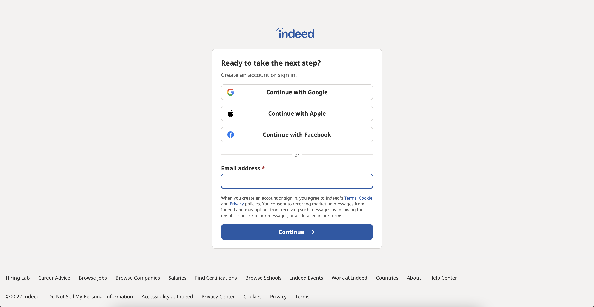
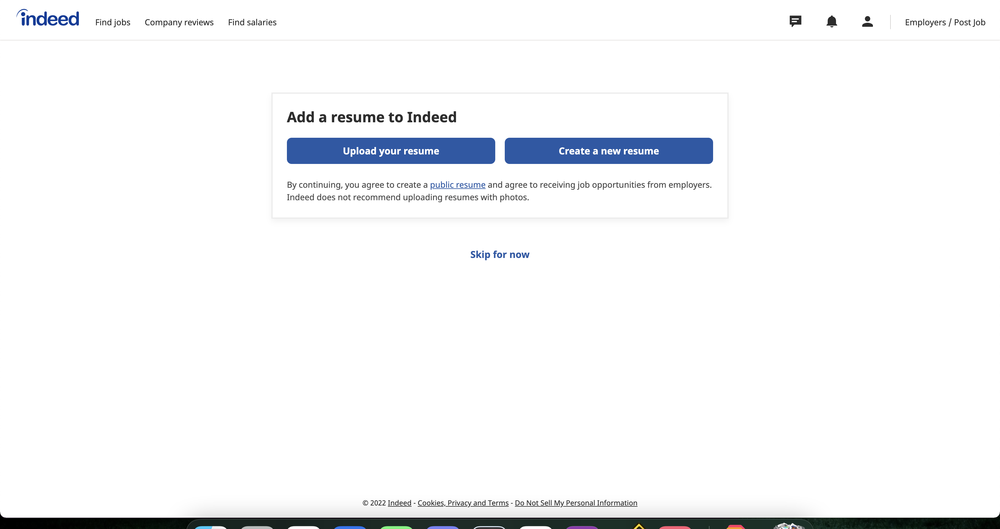
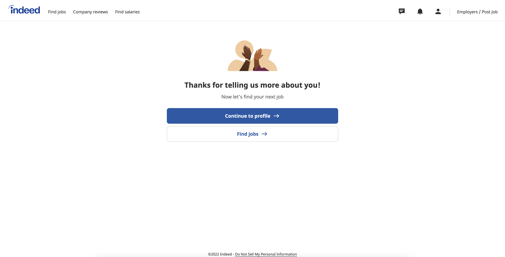
The first three pictures correspond to the [creation of my account.](https://www.indeed.com/)

This is what [my profile](https://my.indeed.com/resume?from=login&continue=https%3A%2F%2Fwww.indeed.com%2F) looks like on Indeed.

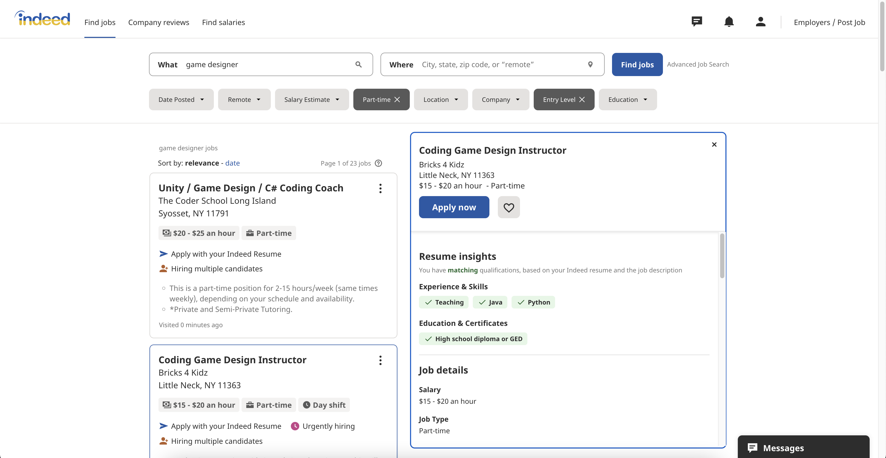
The previous two pictures show how the [job search](https://www.indeed.com/?from=gnav-resume--myind) feature works.

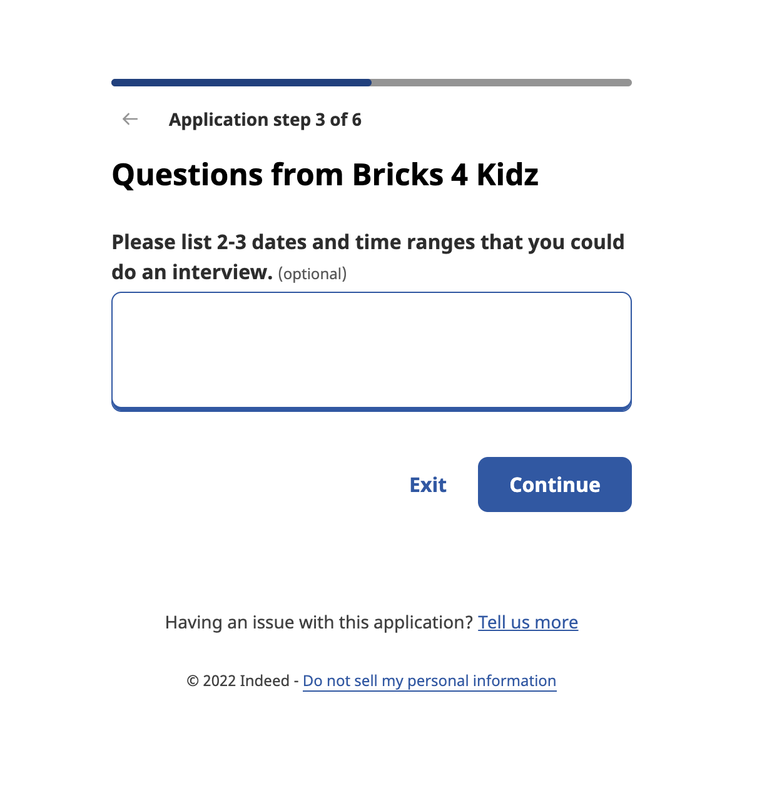
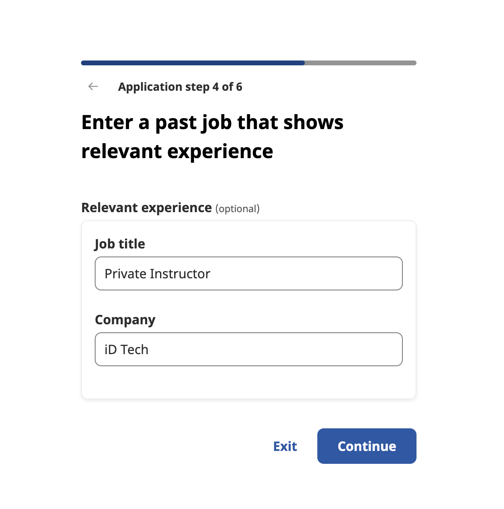
THe previous three pictures show the most important steps from my [job application process.](https://www.indeed.com/jobs?q=game%20design&l&vjk=b3221370c0c04ac2)

| Category | Grade (0-3) | Comments / Justification |
|---|---|---|
| 1. **Don't make me think:** How intuitive was this site? | 3 | Each step was easy to follow and clearly laid out, there was a good use of white space to make each step clear. |
| 2. **Users are busy:** Did this site value your time?  | 2 | Some of the forms fail to save your info and make you retype things, such as reset password or search jobs. This was slightly irksome, but it didn't take much extra time to find jobs that suited me. The only thing that brings this from a 1 to a 2 is the fact that it let me upload my own resume to submit so that I wouldn't have to go through a bunch of extra steps. |
| 3. **Good billboard design:** Did this site make the important steps and information clear? How or how not? | 3 | Each step had a very clear signal on what to click next, and the job search had filters which were easy to use. |
| 4. **Tell me what to do:** Did this site lead you towards a specific, opinionated path? | 3 | It held my hand through each step of the sign up process and application process, which is good since that's a place that I wouldn't want to make a wrong turn. |
| 5. **Omit Words:** How careful was this site with its use of copy? | 2 | On some pages, there was a lot of copy, only some of which I read, but for others, there was only what was necessary and it was easy to follow. |
| 6. **Navigation:** How effective was the workflow / navigation of the site? | 3 | The site was easy to get around and it worked very simply, operating mostly on the use of a single search bar and lots of filters. |
| 7. **Accessibility:** How accessible is this site to a screen reader or a mouse-less interface? | 2 | The job listings would take a long time for screen readers to get through, but there isn't an excess of non-readable content, so it's doable. |
| **TOTAL** | 17 |   |

## 2.3 Site 2
### Glassdoor.com

The [sign up process](https://www.glassdoor.com/) was streamlined and simple enough to follow.

Changing my profile took time because of a failed AI resume scan.

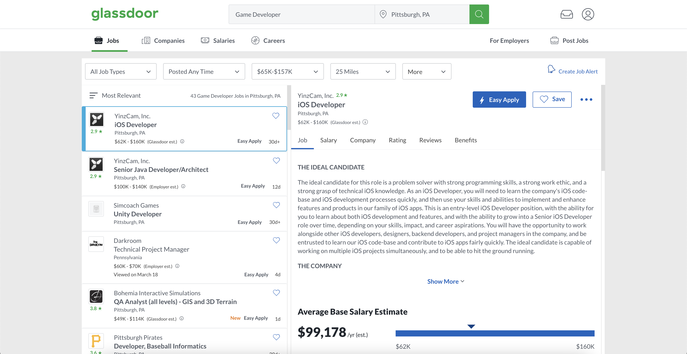
This is the screen I used to [search for job listings.](https://www.glassdoor.com/Job/pittsburgh-ui-ux-designer-jobs-SRCH_IL.0,10_IC1152990_KO11,25.htm?radius=50)

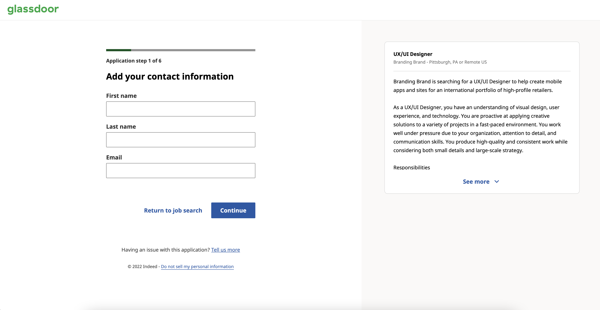
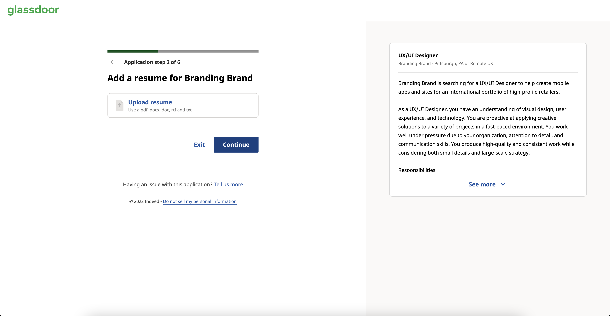
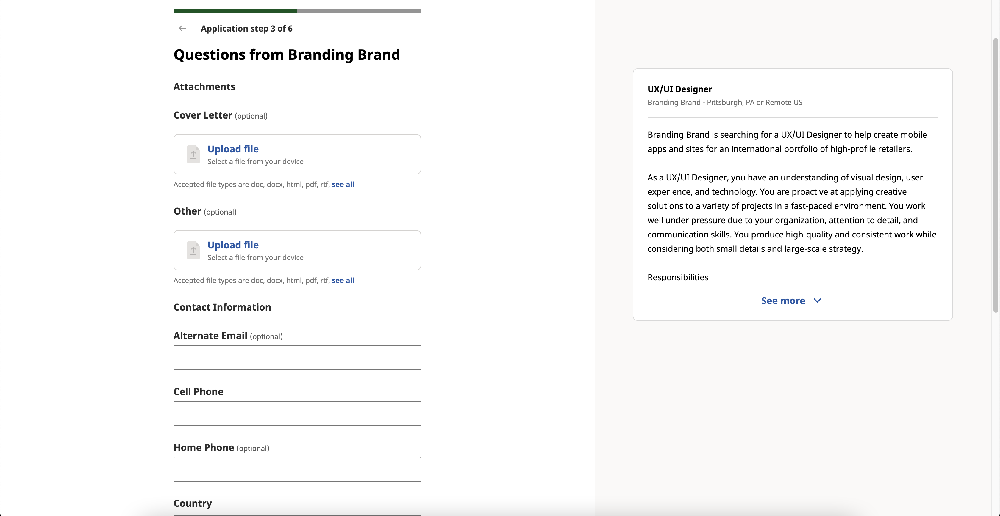
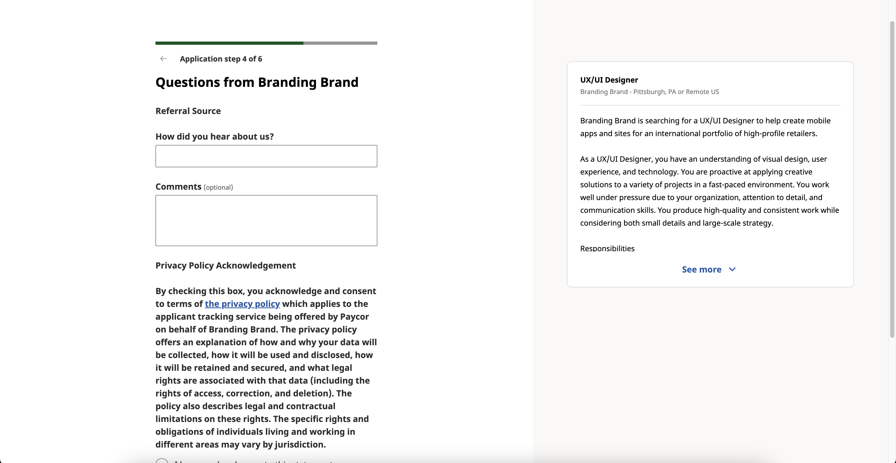
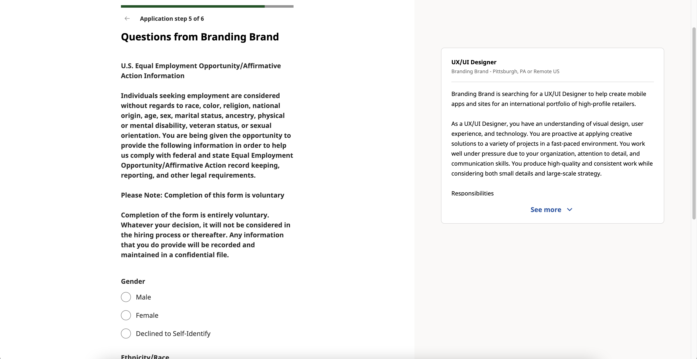
The previous five screenshots show the lengthy application process compared to Indeed.

| Category | Grade (0-3) | Comments / Justification |
|---|---|---|
| 1. **Don't make me think:** How intuitive was this site? | 2 | The site was easy enough to follow along when creating my account and signing up since the copy was limited and buttons were obvious. The shortcomings appear when looking at the main job search portion. There are simply too many options when looking at the main page and I think it could benefit from some content hiding since I didn't intuitively know what most of the navigation tabs do. |
| 2. **Users are busy:** Did this site value your time?  | 1 | The site makes you enter a lot of information when you first create an account, and this is partly worsened by the fact that your resume info is automatically scanned in because now I have to fight the AI and correct a bunch of stuff, so this hurt more than it helped. Also, the application process was longer than Indeed and I had to enter a fair bit more info.  |
| 3. **Good billboard design:** Did this site make the important steps and information clear? How or how not? | 2 | Similarly to the previous critique, there was a lot of info and sometimes it was hard to know what to click on to get to where you wanted. The filters, however, are an improvement from Indeed since your search results change as you change them and it saves your info.  |
| 4. **Tell me what to do:** Did this site lead you towards a specific, opinionated path? | 3 | Once again, the sign up and apply paths were easy to follow and it held my hand throughout. There were some forks in the road when it came to verifying my profile since I had to manually update my info, but I don't think that negatively affected the path that I followed. |
| 5. **Omit Words:** How careful was this site with its use of copy? | 3 | Like Indeed, there is a lot of text on this site, most of which comes from the job listings themself. However, Glassdoor is an improvement because the info is hidden and revealed when you click on the job listing. This is a good way to save users from reading through copy when they want to quickly search through jobs.  |
| 6. **Navigation:** How effective was the workflow / navigation of the site? | 2 | Navigating was simple when I just stuck to the main search page. I barely ventured further than that because I didn't quite know where each tab would take me, and quite honestly, I just didn't care enough to see anything other than just my own profie and the job listings. |
| 7. **Accessibility:** How accessible is this site to a screen reader or a mouse-less interface? | 2 | There are lots of infographics and ratings and diagrams that could make this difficult for screen readers, but most of the site is text-based, so it wouldn't be impossible. |
| **TOTAL** | 15 |   |

# Step 3 Competitive Usability Test

## Step 3.1 Product Use Case

| Use Case #1 | |
|---|---|
| Title | |
| Description / Steps | |
| Primary Actor | |
| Preconditions | |
| Postconditions | |

## Step 3.2 Identifier a competitive product

List of Competitors
1. Competitor 1 [www.awesomesauce.com](www.awesomesauce.com)
2. Competitor 2 [Bangarang Peter](https://www.youtube.com/watch?v=4PNOccSUb1Q)

## Step 3.3 Write a Useability Test

| Step | Tasks | Notes |
|---|---|---|
| 1 |   |   |
| 2 |   |   |
| 3 |   |   |
| ... |   |   |
| n |   |   |

## Step 3.4 Observe User Interactions

| Step | Tasks | Observations |
|---|---|---|
| 1 |   |   |
| 2 |   |   |
| 3 |   |   |
| ... |   |   |
| n |   |   |

## Step 3.5 Findings
Organize your findings here.

# 4. Your UX Rule (Extra Credit)
If you opt to do extra credit, then include it here.